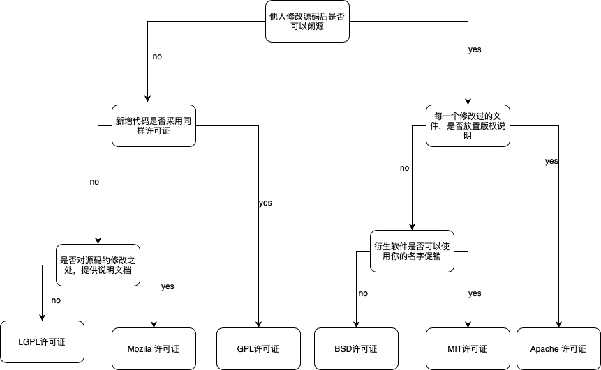

# Git_learning

[toc]

## ERROR

### remote: Permission to xxx/xxx.git denied to xxx. (mac)

方法一：

**第一步：**打开钥匙串

**第二步：**在搜索框输入 github

**第三步：**删除到一条不剩为止，这样接下来再访问 github 账户，就不会出现 `remote: Permission to xxx/xxx.git denied to xxx`。

**注意：**其实也不用把搜索结果中的全部账号删完，双击搜索结果是可以查看这条结果保存的是哪个 github 账户的用户名和密码的，所以，删除除了即将访问的 github 账户之外的所有搜索结果就好了。

方法二修改.git文件夹下配置文件.config：(临时方法)

## Related files

### .gitignore

在使用`git`的过程中，一般我们总会有些文件无需纳入`git`的管理，也不希望它们总出现在未跟踪文件列表，这些文件通常是日志文件、临时文件、编译产生的中间文件、工具自动生成的文件等等。
此时我们可以创建一个名为 `.gitignore` 的文件，列出要忽略的文件模式，Git会根据这些模式规则来判断是否将文件添加到版本控制中。
注意：在windows下可以创建文件名为`.gitignore.`，保存之后系统会自动重命名为 `.gitignore`


`.gitignore`只能忽略那些原来没有被track的文件，如果某些文件已经被纳入了版本管理中，则修改`.gitignore`是无效的。所以一定要养成在项目开始就创建`.gitignore`文件的习惯。
解决方法就是先把本地缓存删除(改变成未track状态)，然后再提交：

```csharp
git rm -r --cached .
git add .
git commit -m "msg"
```


##### java开发通用模版


```ruby
#java
*.class

#package file
*.war
*.ear
*.zip
*.tar.gz
*.rar
#maven ignore
target/
build/

#eclipse ignore
.settings/
.project
.classpatch

#Intellij idea
.idea/
/idea/
*.ipr
*.iml
*.iws

# temp file
*.log
*.cache
*.diff
*.patch
*.tmp

# system ignore
.DS_Store
Thumbs.db
```


## License



